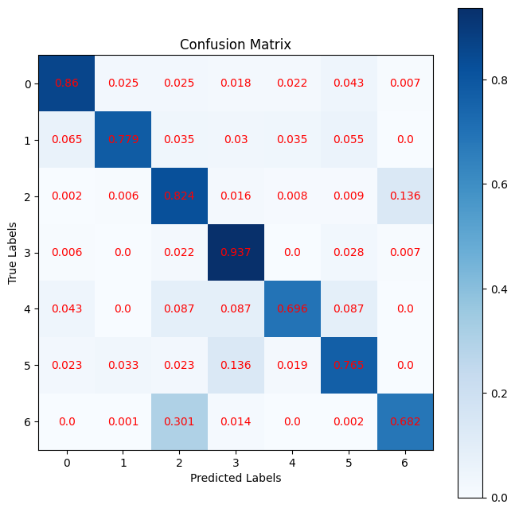

# HealLink - Machine Learning Model

This repository contains experiments and evaluations for a mental health classification model, aiming to classify user text into specific mental health categories.

- [Introduction](#introduction)
- [Dataset Details](#dataset-details)
- [Model Architecture](#model-architecture)
- [Requirements](#requirements)
- [Usage](#usage)
- [Results](#results)
- [Future Work](#future-work)
- [Acknowledgments](#acknowledgments)

## Introduction
The goal of this project is to create a robust NLP model capable of classifying text into specific mental health categories, such as depression, anxiety, and suicidal thoughts. The focus is on leveraging pre-trained BERT models and improving performance through techniques like focal loss and dropout regularization.

## Dataset Details
- Source: [kaggle dataset](https://www.kaggle.com/datasets/suchintikasarkar/sentiment-analysis-for-mental-health)
- Preprocessing:
    - Text tokenization using BERT's tokenizer.
    - Standardization: Lowercasing.
- Imbalance Handling: Addressed class imbalance using weighted loss functions.

## Model Architectures
1. BERT Base (L-12, H-768, A-12)
    - Pretrained weights: bert-en-uncased-l-12-h-768-a-12

## Requirements
1. [Anaconda](https://www.anaconda.com/products/distribution) or [Miniconda](https://docs.conda.io/en/latest/miniconda.html)

## Usage
1. Clone the repository:
   ```bash
   git clone https://github.com/HealLink/ML-Model.git
   cd ML-Model
   ```
2. Create and activate a Conda environment
    ```
    conda create -n model-env python=3.11.10 -y
    conda activate model-env
    ```
3. Install dependencies
    ```
    pip install -r final_requirements.txt
    ```
4. Run notebook_final.ipynb inside the notebooks subdirectory

## Results
- The current best model achieved:
    - Epoch: 3
    - Train loss: 0.053625717759132385
    - Val loss: 0.07334809750318527
    - Train MCC: 0.8384552001953125
    - Val MCC: 0.7475522756576538
    - Train Accuracy: 0.8738927841186523
    - Val Accuracy: 0.8009008765220642
- Confusion Matrix (Test set):
    

## Acknowledgements
- Thanks to Allah Subhanahu Wa Ta'ala for all his grace and favor, so that this project can be completed properly.
- Thanks to TensorFlower for creating TensorFlow Framework.
- Thanks to Google for creating BERT as base model.
- Thanks to Mr. Andrew Ng and Mr. Laurence in Coursera for teaching ML.
- Thanks to Bangkit Teams for this learning opportunity.
- Thanks to Suchintika Sarkar for compiling and cleaning the dataset.
